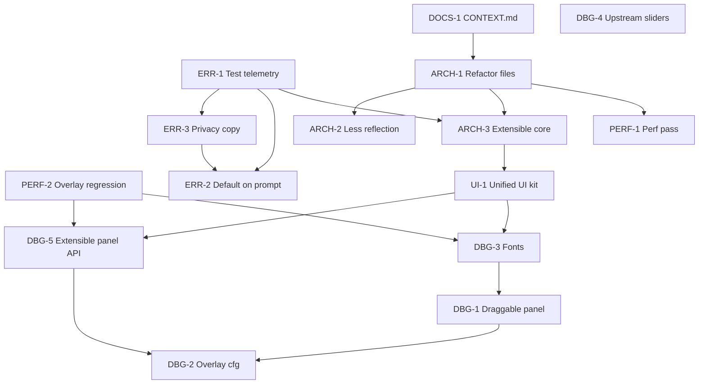

# Dread roadmap / backlog

Planned work tracked as GitHub issues. See `docs/agents/issue-tracker.md` for CLI conventions.

**Codebase quality reviews:** Section audits live under [`docs/reviews/`](reviews/README.md) (01-09; **exclude** `*-brainstorm.md` for backlog). Consolidated doc drift: [09-documentation-review.md](reviews/09-documentation-review.md#drift-register). New IDs below cite review numbers (e.g. `review 08`).

**Status key:** `idea` = not started, `in-progress` = active branch, `blocked` = needs upstream or design decision, `done` = shipped (close issue + update CHANGELOG).

**Priority key:**

| Priority | Meaning |
|----------|---------|
| **P0** | Do first: blocks other work, legal/product risk, or core stability |
| **P1** | Do soon: high value after P0 gates |
| **P2** | Polish: UX and performance after structure is stable |
| **P3** | Later or blocked: upstream dependency or optional cleanup |

---

## Execution order (what to complete first)

Work top to bottom within each phase. Do not skip **Depends on** unless the issue is explicitly closed.

### Already shipped (maintain only)

| ID | Item | Notes |
|----|------|-------|
| (compat) | **REPOConfig slider labels** | `RepoConfigSliderLabelCompat` when REPOConfig is loaded: restores names at x=100, compact row. Names readable; left-column alignment vs toggles still imperfect. **Do not remove** until DBG-4 upstream or verified A/B without compat. |
| DOCS-1 | **Root `CONTEXT.md`** | Glossary + file map ([#174](https://github.com/grompen91-droid/dreadREPO/issues/174), PR #179) |
| AUDIO-1 | **Audio playback + stub UWR hardening** | `AudioPlayUtil` (pitch-aware destroy); NVorbis read-until-EOF; `UnityWebRequestCompat`; error reporter batch POST via `HttpWebRequest`; psychotic break no longer `Destroy`s cached clips. PR #203. See `docs/agents/guides/audio-dread-and-loading.md` |
| ARCH-1 | **File split** | `Systems/Patches/`, `PsychoticBreak/`, `ErrorReporting/`, `DebugOverlay/`. PR [#201](https://github.com/grompen91-droid/dreadREPO/pull/201) |
| ARCH-2 | **Reflection inventory + stub/full docs** | PR [#202](https://github.com/grompen91-droid/dreadREPO/pull/202) |
| ARCH-3 | **`DreadSystemRegistry` + fail-safe init** | PR [#204](https://github.com/grompen91-droid/dreadREPO/pull/204); ADR-0016 |
| ERR-3 | **Privacy disclosure copy** | PR [#207](https://github.com/grompen91-droid/dreadREPO/pull/207) |
| ERR-2 | **Default-on + first-run prompt** | PR [#208](https://github.com/grompen91-droid/dreadREPO/pull/208) |
| DEV-1 | **Repo hygiene** | GPL-3.0 `LICENSE`, `SECURITY.md`, Dependabot, CodeQL on stubs. PR [#194](https://github.com/grompen91-droid/dreadREPO/pull/194) |
| DEV-2 | **Toolchain deps** | Vitest 4 + `cloudflareTest()` (#200); Zod 4 + TS 6 MCP (#195, #198); GitHub Actions v6/v7 (#196). Dependabot #197/#199 closed (Vitest 4 required config migration) |
| AUDIO-5 | **Remote audio (GitHub Release + cache)** | `AudioAssetSystem`, `AudioAssetApi`, DLL-only Thunderstore; ADR-0017 | PR [#237](https://github.com/grompen91-droid/dreadREPO/pull/237) |
| DOCS-2 | **Agent structure governance + review index** | `systems-folder-governance.md`, `docs/reviews/README.md`, hub links | PR [#242](https://github.com/grompen91-droid/dreadREPO/pull/242) |
| NOTIF-0 | **Corner toasts (`DreadNotificationSystem`)** | Slate HUD S2; thread-safe `Info`/`Warn`/`Bad`; see [ui-notifications.md](agents/guides/ui-notifications.md) | CHANGELOG `[Unreleased]` |
| ERR-2b | **Error payload enemy/player compat** | `EnemyHealthCompat` + `ProximityScan` in capture (no `get_CurrentHealth`) | CHANGELOG `[Unreleased]` fix |

### 2026-06 merge log (reference)

| PR | Summary |
|----|---------|
| [#237](https://github.com/grompen91-droid/dreadREPO/pull/237) | AUDIO-5 remote audio assets |
| [#242](https://github.com/grompen91-droid/dreadREPO/pull/242) | Codebase quality reviews 01-09 + `systems-folder-governance.md` |
| [#235](https://github.com/grompen91-droid/dreadREPO/pull/235) | Agent documentation sync (registry counts, CONTRIBUTING verify) |
| [#244](https://github.com/grompen91-droid/dreadREPO/pull/244) | Post-014 doc pass (ten systems, `audio-cache` install notes) |

### 2026-05-29 merge log (reference)

| PR | Author | Summary |
|----|--------|---------|
| [#194](https://github.com/grompen91-droid/dreadREPO/pull/194) | agent | GPL-3.0, tailored Dependabot/SECURITY, CodeQL C# stub build |
| [#195](https://github.com/grompen91-droid/dreadREPO/pull/195)-[#198](https://github.com/grompen91-droid/dreadREPO/pull/198) | dependabot | zod 4, GitHub Actions, MCP tooling (TS 6) |
| [#200](https://github.com/grompen91-droid/dreadREPO/pull/200) | agent | Vitest 4 + Cloudflare pool 0.16 + `vitest.config.mts` |
| [#201](https://github.com/grompen91-droid/dreadREPO/pull/201) | noxaur | ARCH-1 god-file split |
| [#202](https://github.com/grompen91-droid/dreadREPO/pull/202) | noxaur | ARCH-2 reflection reductions |
| [#203](https://github.com/grompen91-droid/dreadREPO/pull/203) | noxaur | Audio lifetime + stub UWR |
| [#204](https://github.com/grompen91-droid/dreadREPO/pull/204) | noxaur | ARCH-3 system registry |
| [#207](https://github.com/grompen91-droid/dreadREPO/pull/207) | noxaur | ERR-3 privacy copy |
| [#208](https://github.com/grompen91-droid/dreadREPO/pull/208) | noxaur | ERR-2 default-on + prompt |

### Phase 1: Foundation (FINISHED)

| Order | ID | Priority | Issue | Depends on | Why first |
|-------|-----|----------|-------|------------|-----------|
| 1 | ERR-1 | **P0** | [#171](https://github.com/grompen91-droid/dreadREPO/issues/171) | None | Must prove telemetry works before default-on or public promises |
| 2 | PERF-2 | P1 | [#170](https://github.com/grompen91-droid/dreadREPO/issues/170) | None | Done: component disabled when off; guard + manual checklist |

### Phase 2: Structure (FINISHED)

| Order | ID | Priority | Issue | Depends on | Status |
|-------|-----|----------|-------|------------|--------|
| 4 | ARCH-1 | **P0** | [#167](https://github.com/grompen91-droid/dreadREPO/issues/167) | DOCS-1 (soft) | done (#201) |
| 5 | ARCH-2 | P1 | [#168](https://github.com/grompen91-droid/dreadREPO/issues/168) | ARCH-1 (soft) | done (#202) |

### Phase 3: Harden core and telemetry product (FINISHED)

| Order | ID | Priority | Issue | Depends on | Status |
|-------|-----|----------|-------|------------|--------|
| 6 | ARCH-3 | **P0** | [#175](https://github.com/grompen91-droid/dreadREPO/issues/175) | ARCH-1, ERR-1 (soft) | done (#204) |
| 7 | ERR-3 | P1 | [#173](https://github.com/grompen91-droid/dreadREPO/issues/173) | ERR-1 | done (#207) |
| 8 | ERR-2 | P1 | [#172](https://github.com/grompen91-droid/dreadREPO/issues/172) | ERR-1, ERR-3 | done (#208) |

### Phase 4: Player-facing UI and debug overlay polish (FINISHED)

| Order | ID | Priority | Issue | Depends on | Status |
|-------|-----|----------|-------|------------|--------|
| 9 | UI-1 | P2 | (shipped) | ARCH-3 (soft) | done (PR #247) |
| 10 | DBG-5 | P2 | (shipped) | PERF-2, UI-1 (soft) | done (PR #249) |
| 11 | DBG-3 | P2 | [#165](https://github.com/grompen91-droid/dreadREPO/issues/165) | PERF-2, UI-1 (soft) | done (PR #248) |
| 12 | DBG-1 | P2 | [#163](https://github.com/grompen91-droid/dreadREPO/issues/163) | DBG-3 (soft) | done (draggable + persist shipped) |
| 13 | DBG-2 | P2 | [#164](https://github.com/grompen91-droid/dreadREPO/issues/164) | DBG-1, DBG-5 (soft) | done (PR #250) |

### Phase 5: Performance optimization (PAUSED)

| Order | ID | Priority | Issue | Depends on | Why |
|-------|-----|----------|-------|------------|-----|
| 14 | PERF-1 | P2 | [#169](https://github.com/grompen91-droid/dreadREPO/issues/169) | ARCH-1, PERF-2 | Profile stable codebase; avoid optimizing files about to move |

> **PERF-1 status:** intentionally not started. It is a measurement-driven pass (overlay, tension, audio, Harmony) that needs an in-game Unity profiler session; guessing at optimizations without a capture risks churn for no gain. PERF-2 (zero cost when the overlay is hidden) already shipped. Pick PERF-1 up with a real profile capture once Phase 7 structural moves (UI-2/UI-3 folder moves) settle.

### Phase 6: Upstream / cleanup

| Order | ID | Priority | Issue | Depends on | Why |
|-------|-----|----------|-------|------------|-----|
| 15 | DBG-4 | P3 | [#166](https://github.com/grompen91-droid/dreadREPO/issues/166) | REPOConfig or MenuLib fix | Remove temporary slider compat; **blocked** on upstream |

> **DBG-4 status:** blocked on upstream. `RepoConfigSliderLabelCompat` cannot be removed until REPOConfig/MenuLib emits slider descriptions (or matches the toggle layout) upstream. Removing it now regresses slider labels for everyone running REPOConfig, so the compat stays until the upstream fix lands. Nothing to implement here.

### Phase 7: Code quality (from `docs/reviews/` 01-09)

Work top to bottom. File GitHub issues with `ready-for-agent` and cite review + roadmap ID.

| Order | ID | Priority | Review | Depends on | Why |
|-------|-----|----------|--------|------------|-----|
| 16 | CI-1 | **P0** | 01, 03, 04, 05, 06, 07 | None | **done:** analyze + Tier 0 grep recurse `Systems/**/*.cs`; nested violations fixed |
| 17 | MCP-1 | **P0** | 08 | CI-1 (soft) | **done:** log/patch text formatters match Unity JSON; `get_state` description fixed |
| 18 | MCP-2 | P1 | 08 | None | **done:** `MaxMessageBytes` enforced on TCP read, `code:-3` reject (ADR-0013) |
| 19 | CORE-2 | P1 | 01, 04 | None | **done:** fail-closed on probe failure, one-time Warning |
| 20 | CORE-1 | P1 | 01, 05 | None | **done:** forced tumble keyed per `PlayerController` instance id |
| 21 | ARCH-1b | P1 | 07, 09 | ARCH-1 | Finish folder map: move root loose files per [systems-folder-governance.md](agents/systems-folder-governance.md) |
| 22 | ERR-8 | P1 | 06, 07 | ARCH-1b (soft) | Move `ErrorReportJson.cs` + `ErrorReportTypes.cs` under `ErrorReporting/` |
| 23 | PATCH-1 | P1 | 04 | None | `Plugin.OnDestroy` (or unload) calls Harmony `Remove` on all patch classes |
| 24 | PB-1 | P1 | 05 | CORE-1 (soft) | Psychotic break `OnDestroy`/scene: restore control, stop stumble coroutine |
| 25 | MCP-3 | P1 | 08 | MCP-1 | Vitest suite for `dread-mcp-server`; optional hook in `verify-dread.ps1` |
| 26 | ERR-4 | P2 | 06 | ERR-1 | Non-blocking batch flush (already on ROADMAP; review 06 confirms main-thread hitch) |
| 27 | ERR-5 | P2 | 06 | None | `PendingLogs` backpressure when queue full |
| 28 | CORE-3 | P2 | 01, 06 | None | Error capture player stats via `PlayerControllerCompat` |
| 29 | UI-2 | P2 | 02 | UI-1 (soft) | `DreadImGuiTheme` + migrate overlay/prompt styles (UI-1 foundation) |
| 30 | UI-3 | P2 | 02 | UI-2 (soft) | Move `OverlayTextureUtil` + prompt to `Systems/UI/`; `DebugServer` to `Systems/Debug/` |
| 31 | PATCH-2 | P2 | 04 | PATCH-1 (soft) | Foreign-patch skip parity on player/debug patches |
| 32 | PB-2 | P2 | 05 | None | Refresh ADR-0011 + `psychotic-break.md` vs shipped audio/trigger names |
| 33 | MCP-4 | P2 | 08 | None | CI: `npm ci && npm run build` for `dread-mcp-server` on relevant PRs |
| 34 | DEV-3 | P2 | 08 | MCP-3 (soft) | Same as MCP-4 if folded into one issue |
| 35 | NOTIF-2 | P2 | 03 | UI-3 (soft) | Separate telemetry consent from toast host; optional `SystemOrderGroup.Ui` (toasts **shipped** as NOTIF-0) |
| 36 | DBG-6 | P2 | 02 | PERF-2 | Gate overlay FPS sampling when F10 hidden |
| 37 | DOCS-3 | P3 | 09 | None | Renumber duplicate ADR `0007-*` filenames or add disambiguation index |
| 38 | ERR-6 | P3 | 06 | None | Prune `RecentHashes` in error reporter |
| 39 | ERR-7 | P3 | 06 | ERR-4 (soft) | Narrow Worker batch requeue on partial success |

---

## Player-facing UI

| ID | Priority | Item | Notes | Status | Issue |
|----|----------|------|-------|--------|-------|
| UI-1 | P2 | **Unified Dread UI kit** | Shipped as `Systems/UI`: `DreadTheme` (Slate palette), `DreadGui` (shared `EmptyContent`, Proton-safe `SolidTexture`, `FlatBox`/`Label`/`Button` builders), `DreadInputCapture` (cursor + player input lock). Overlay, widgets, toasts, and error prompt migrated onto it. Theme/helpers/input-capture delivered; a full modal+scroll component can extend it later (UI-2/UI-3). | done | PR #247 |

---

## Debug overlay

| ID | Priority | Item | Notes | Status | Issue |
|----|----------|------|-------|--------|-------|
| DBG-1 | P2 | **Refine debug panel UX** | Draggable panel (header grab, screen-clamp, persisted X/Y) shipped; F9 interactive mouse mode. Resize/snap not pursued. | done | [#163](https://github.com/grompen91-droid/dreadREPO/issues/163) |
| DBG-2 | P2 | **Richer overlay configuration** | Background opacity, persisted kit-demo toggle, forgiving on-screen position clamp on load. | done | PR #250 ([#164](https://github.com/grompen91-droid/dreadREPO/issues/164)) |
| DBG-3 | P2 | **Font fixes** | `DreadFont` dynamic OS-font fallback chain (Proton/Linux); `TextRenderingModule` referenced in all builds. | done | PR #248 ([#165](https://github.com/grompen91-droid/dreadREPO/issues/165)) |
| DBG-4 | P3 | **REPOConfig slider labels (upstream)** | Remove `RepoConfigSliderLabelCompat` after REPOConfig/MenuLib pass descriptions or match toggle layout. Optional Dread polish (left align) only if compat stays; pivot/alignment experiments reverted 2026-05-30 | blocked | [#166](https://github.com/grompen91-droid/dreadREPO/issues/166) |
| DBG-5 | P2 | **Extensible overlay panel API** | `DebugOverlayRegistry` + `IOverlaySection` / `IOverlayRowSink` (semantic `OverlayStatus`); features add foldable, persisted sections without editing `DebugOverlaySystem`. Interactive controls (toggles/sliders) can extend the sink later. | done | PR #249 |

See also: `docs/repo-config-slider-labels-investigation.md`.

---

## Architecture and dependencies

| ID | Priority | Item | Notes | Status | Issue |
|----|----------|------|-------|--------|-------|
| ARCH-1 | P0 | **Refactor into manageable files** | Phase 1 split (`Patches/`, `PsychoticBreak/`, etc.); **follow-up:** ARCH-1b per review 07 | done | [#167](https://github.com/grompen91-droid/dreadREPO/issues/167) |
| ARCH-1b | P1 | **Complete `Systems/` folder map** | Move remaining root loose files per [systems-folder-governance.md](agents/systems-folder-governance.md); update `domain.md` | idea | (to file; review 07) |
| ARCH-4 | P3 | **External mod API + feature modules** | Optional cfg feature packs; documented BepInEx soft-dependency API; semver + ADR; after ARCH-3 | idea | (to file) |
| ARCH-2 | P1 | **Reduce DLL / reflection surface** | Compile-time refs; document stub vs full build | done | [#168](https://github.com/grompen91-droid/dreadREPO/issues/168) |
| ARCH-3 | P0 | **Extensibility + hardened core** | Extension points, fail-safe init, compat patterns | done | [#175](https://github.com/grompen91-droid/dreadREPO/issues/175) (`specs/002-arch-3-extensible-core/`) |

---

## Performance

| ID | Priority | Item | Notes | Status | Issue |
|----|----------|------|-------|--------|-------|
| PERF-1 | P2 | **Performance pass** | Profile overlay, tension/audio, enemy cache, Harmony | idea | [#169](https://github.com/grompen91-droid/dreadREPO/issues/169) |
| PERF-2 | P1 | **Overlay when hidden** | Component disabled when off (no `Update`/`OnGUI`); guard + checklist `docs/agents/overlay-perf-checklist.md` | done | [#170](https://github.com/grompen91-droid/dreadREPO/issues/170) |

---

## Error reporting and telemetry

| ID | Priority | Item | Notes | Status | Issue |
|----|----------|------|-------|--------|-------|
| ERR-1 | P0 | **Test error reporting end-to-end** | TestCrash, MCP, real exceptions (ADR-0010, ADR-0012, ADR-0015); checklist in `docs/agents/error-reporting-test-checklist.md` | done | [#171](https://github.com/grompen91-droid/dreadREPO/issues/171) |
| ERR-2 | P1 | **Default on + first-run prompt** | Default `ErrorReportingEnabled` true; `ErrorReportingPromptSystem` + consent gate | done | [#172](https://github.com/grompen91-droid/dreadREPO/issues/172) (PR #208) |
| ERR-2b | P1 | **Core error capture fix** | `EnemyHealthCompat` + `ProximityScan` in payloads (no direct `CurrentHealth`) | done | CHANGELOG `[Unreleased]`; was PR #213 |
| ERR-5 | P2 | **Log queue backpressure** | Warn or ring-buffer when `PendingLogs` full | idea | (to file; review 06) |
| ERR-6 | P2 | **Prune `RecentHashes`** | Prevent unbounded growth in error reporter | idea | (to file; review 06) |
| ERR-7 | P2 | **Safer Worker batch requeue** | Do not requeue full batch after partial GitHub success | idea | (to file; review 06) |
| ERR-8 | P1 | **Colocate error JSON types** | Move `ErrorReportJson.cs` / `ErrorReportTypes.cs` into `ErrorReporting/` | idea | (to file; review 06, 07) |
| ERR-9 | P2 | **ADR transport wording sync** | ADR-0010/0012 diagrams match ADR-0015 `HttpWebRequest` | idea | (to file; review 06) |
| ERR-10 | P3 | **Shared input-lock helper** | DRY ERR-2 prompt + psychotic break lockdown reflection | idea | (to file; review 06) |
| ERR-3 | P1 | **Privacy copy** | Canonical disclosure + cfg description; ERR-2 uses same strings | done | [#173](https://github.com/grompen91-droid/dreadREPO/issues/173) (PR #207, `specs/003-err-3-privacy-copy/`) |
| ERR-4 | P2 | **Non-blocking batch flush** | `SendBatch` uses sync `HttpWebRequest` on main thread (up to 15s). Prefer `UnityWebRequest` when `UnityWebRequestCompat.IsUsable`, else background thread. Narrow `ShouldIgnoreUnityLog` if we need non-UWR `BadImageFormatException` reports | idea | (to file) |

**Current behavior:** `ErrorReportingEnabled` defaults to **true** for new cfg. First gameplay level shows one-time prompt; no upload until acknowledged. Upgrades keep saved `false`. Batch flush: `ErrorReportUploader.TryPostPayloadSync` (ADR-0015). Payload capture uses Core compat (ERR-2b done on `master`).

---

## Audio and atmosphere

| ID | Priority | Item | Notes | Status | Issue |
|----|----------|------|-------|--------|-------|
| AUDIO-1 | P1 | **Pitch-aware playback + NVorbis EOF + stub UWR** | `AudioPlayUtil`; chunked NVorbis; `UnityWebRequestCompat`; shared clip cache safe in psychotic break | done | PR #203 |
| AUDIO-5 | P1 | **Remote audio via GitHub Release** | `AudioAssetSystem`, embedded manifest, adaptive downloads, cache reconcile + prune | done | PR [#237](https://github.com/grompen91-droid/dreadREPO/pull/237) |
| AUDIO-6 | P2 | **Dev BundleAudio profile** | MSBuild `BundleAudio=true` copies local `audio/` for offline dev | idea | (deferred) |
| ASSET-1 | P3 | **Remote images (future)** | Reuse remote-assets pattern; manifest + cache | idea | (to file) |
| AUDIO-2 | P2 | **Unit tests for `AudioPlayUtil`** | Golden cases: pitch 0.5 doubles wall-clock lifetime; edge pitch clamp | idea | (to file) |
| AUDIO-3 | P2 | **NVorbis load performance** | Replace per-sample `List.Add` with block copy for large OGGs; handle partial final frame if needed | idea | (to file) |
| AUDIO-4 | P2 | **`PlayPeakScream` DRY** | Use `AudioPlayUtil` for destroy timing (pitch fixed at 1.0 today) | done | PR #203 (`PlayPeakScream`) |

Stub/local builds: always use real game `Managed` DLLs for release packages when possible (`build.ps1` warns on stub-only compile). CI may still use stubs; NVorbis is the primary audio path.

---

## Documentation and agent context

| ID | Priority | Item | Notes | Status | Issue |
|----|----------|------|-------|--------|-------|
| DOCS-1 | P1 | **Add root `CONTEXT.md`** | Glossary + bounded context for agents | done | [#174](https://github.com/grompen91-droid/dreadREPO/issues/174) |
| DOCS-2 | P1 | **Structure governance + review index** | `systems-folder-governance.md`, `docs/reviews/`, hub links | done | PR [#242](https://github.com/grompen91-droid/dreadREPO/pull/242) |
| DOCS-3 | P3 | **ADR-0007 filename collision** | Two files share `0007` prefix; renumber or index | idea | (to file; review 09) |

---

## CI and tooling

| ID | Priority | Item | Notes | Status | Issue |
|----|----------|------|-------|--------|-------|
| CI-1 | **P0** | **Analyze nested `Systems/**`** | `ci.yml` analyze + `verify-dread.ps1` grep recurse `Systems/**/*.cs`; nested `!.` and >120-col violations fixed | done | (reviews 01-07) |
| DEV-3 | P2 | **MCP package in CI** | `npm ci && npm run build` in `dread-mcp-server` on PRs touching MCP | idea | (to file; review 08) |

---

## Core compat (`Systems/Core/`)

| ID | Priority | Item | Notes | Status | Issue |
|----|----------|------|-------|--------|-------|
| CORE-1 | P1 | **Per-player forced tumble** | `PlayerTumbleCompat` keys forced state by controller instance id (reference-checked), not a static bool | done | (review 01, 05) |
| CORE-2 | P1 | **Fail-closed master client** | `IsMasterClient()` returns false when the `SemiFunc` probe is missing or throws; warns once | done | (review 01, 04) |
| CORE-3 | P2 | **Error capture uses compat** | Wire `ErrorReportPayloadCapture` HP/stamina via `PlayerControllerCompat` | idea | (to file; review 01, 06) |
| CORE-4 | P3 | **Remove or wire `GetStamina`** | Dead API on `PlayerControllerCompat` | idea | (to file; review 01) |

---

## Harmony patches

| ID | Priority | Item | Notes | Status | Issue |
|----|----------|------|-------|--------|-------|
| PATCH-1 | P1 | **Harmony teardown on unload** | `Plugin.OnDestroy` removes all Dread patches | idea | (to file; review 04) |
| PATCH-2 | P2 | **Foreign-patch skip parity** | Extend skip to player/debug patches or document enemy-only | idea | (to file; review 04) |
| PATCH-3 | P3 | **Patch multiplier constants** | Named constants for aggression/investigate/crouch | idea | (to file; review 04) |

---

## MCP bridge (`dread-mcp-server/`)

| ID | Priority | Item | Notes | Status | Issue |
|----|----------|------|-------|--------|-------|
| MCP-1 | **P0** | **Fix log/patch text formatters** | Text mode reads Unity JSON (`Level`, `Message`, `Timestamp`; flat patch counts); `get_state` description corrected | done | (review 08) |
| MCP-2 | P1 | **Enforce `MaxMessageBytes`** | Oversized TCP lines rejected with `code:-3` before enqueue; shared `TryWriteReject` with queue-full path | done | (review 08) |
| MCP-3 | P1 | **MCP vitest suite** | Fixture TCP responses; `npm test` | idea | (to file; review 08) |
| MCP-4 | P2 | **MCP CI build step** | Same scope as DEV-3 | idea | (to file; review 08) |

---

## Psychotic break

| ID | Priority | Item | Notes | Status | Issue |
|----|----------|------|-------|--------|-------|
| PB-1 | P1 | **Episode lifecycle cleanup** | `OnDestroy`/scene: restore control, release tumble, stop stumble | idea | (to file; review 05) |
| PB-2 | P2 | **ADR-0011 + guide refresh** | Audio names, hiding, partial layout | idea | (to file; review 05) |
| PB-3 | P2 | **Trigger predicate DRY** | Merge `GetTriggerBlockReason` and `CanTrigger` | idea | (to file; review 05) |
| PB-4 | P3 | **Solo scan performance** | Replace periodic `FindObjectsOfType` for player count | idea | (to file; review 05) |

---

## Notifications and player messaging

| ID | Priority | Item | Notes | Status | Issue |
|----|----------|------|-------|--------|-------|
| NOTIF-0 | P2 | **Corner toasts (shipped)** | `DreadNotificationSystem` + `DreadWidgets`; guide: [ui-notifications.md](agents/guides/ui-notifications.md) | done | CHANGELOG `[Unreleased]` |
| NOTIF-2 | P2 | **Consent vs toast boundaries** | Do not reuse `ErrorReportingConsent` for UI; optional `SystemOrderGroup.Ui` after UI-3 | idea | (to file; review 03) |

Note: review 03 predates NOTIF-0; backlog focuses on **structure** (prompt under `ErrorReporting/` vs `Systems/UI/`), not building toasts from scratch.

---

## UI kit and overlay (extends Phase 4)

| ID | Priority | Item | Notes | Status | Issue |
|----|----------|------|-------|--------|-------|
| UI-2 | P2 | **UI-1 theme foundation** | `DreadImGuiTheme` + shared `ImGuiTexture` from `OverlayTextureUtil` | idea | (to file; review 02) |
| UI-3 | P2 | **UI folder moves** | `Systems/UI/Shared`, `ImGui/`, `Debug/` per governance | idea | (to file; review 02, 07) |
| UI-4 | P2 | **IMGUI texture lifecycle** | Destroy helper textures in overlay/prompt `OnDestroy` | idea | (to file; review 02) |
| UI-5 | P2 | **Harmony patch count DRY** | `HarmonyPatchCompat.CountPatchesOwnedBy` for overlay + server | idea | (to file; review 02) |
| DBG-6 | P2 | **Overlay FPS when hidden** | Gate `SampleFrameStats` when F10 closed (PERF-2 follow-up) | idea | (to file; review 02) |

---

## How to use this file

1. Pick the next row from **Execution order** (lowest order number not `done`).
2. For quality fixes, prefer **Phase 7** after Phase 4 unless a DBG/UI issue is explicitly assigned.
3. Work the linked GitHub issue; reference roadmap ID and review number in PR body (`CI-1`, `review 08`, etc.).
4. When shipped: close issue, update `CHANGELOG.md` `[Unreleased]`, mark `done` here.
5. Agents: start at [`docs/agents/README.md`](agents/README.md), then [`CONTEXT.md`](../CONTEXT.md), [`docs/agents/domain.md`](agents/domain.md), [`docs/agents/systems-folder-governance.md`](agents/systems-folder-governance.md), and [`docs/agents/orchestration.md`](agents/orchestration.md) before implementing.

**Suggested first issues for a new contributor:** CI-1 (review 01), MCP-1 (review 08), #165 (DBG-3 fonts). **Suggested agent starter (structure):** ARCH-1b after reading review 07 + governance doc.

**Do not execute** tasks from `docs/agents/archive/superpowers/` or stale `docs/superpowers/plans/`; use guides under `docs/agents/guides/`.
