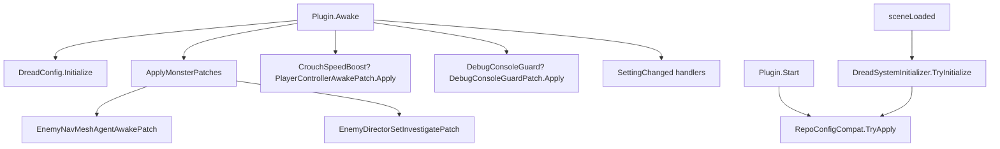

# Code Review: Systems/Patches (and Harmony infrastructure)

**Reviewed:** 2026-06-02  
**Scope:** `Systems/Patches/*.cs`, patch registration (`Plugin.cs`), `HarmonyPatchCompat`, `DreadSystemInitializer` Harmony touchpoints, agent docs/ADRs for patch lifecycle. Cross-references `Systems/Core/RepoConfigSliderLabelCompat.cs` as related Harmony infrastructure (not re-reviewed in depth; see [01-core-review.md](01-core-review.md)).  
**Files inventoried:** `EnemyNavMeshAgentAwakePatch.cs`, `EnemyDirectorSetInvestigatePatch.cs`, `PlayerControllerAwakePatch.cs`, `DebugConsoleGuardPatch.cs`, `Systems/Core/HarmonyPatchCompat.cs`, `Plugin.cs`, `DreadSystemInitializer.cs`, `docs/agents/guides/harmony-and-patches.md`

## Executive Summary

`Systems/Patches/` is a **small, deliberate Harmony surface** (four patch classes, ~223 lines total): explicit `Apply`/`Remove` lifecycle per ADR-0009, config-gated install in `Plugin.Awake`, and host gates for monster gameplay via `HarmonyPatchCompat` (ADR-0004). The split from `Systems/Core/` is correct: **gameplay IL patches** live in `Patches/`; **shared gates and REPOConfig MenuLib hooks** live in Core.

Main risks align with prior reviews: **CI analyze globs skip `Systems/Patches/**`**, **`IsMasterClient()` fails open** (monster patches may run on clients when reflection breaks), **inconsistent foreign-patch skip** (only enemy patches use `ShouldSkipDueToForeignPatches`), **doc drift** (`harmony-and-patches.md` path, ADR-0009 “Apply throws” vs log-and-return), and **scattered Harmony-related code** (Core REPOConfig patches, debug overlay patch counting, psychotic break `Traverse` without being under `Patches/`). No dead patch files; no unused `Apply` entry points.

Flat `Systems/Patches/` is appropriate at four files. Subfolders (`Enemy/`, `Player/`, `Debug/`) are optional until the inventory grows.

## Patch inventory

| Class | Target | Kind | Priority | Config apply | Runtime guards | Host-only | Foreign skip | Lines |
|-------|--------|------|----------|--------------|----------------|-----------|--------------|------:|
| `EnemyNavMeshAgentAwakePatch` | `EnemyNavMeshAgent.Awake` | Postfix | `Last` | `MonsterAggressionEnabled` && !`CompatibilityMode` | Same + `IsMasterClient()` | Yes | Yes | 63 |
| `EnemyDirectorSetInvestigatePatch` | `EnemyDirector.SetInvestigate` | Prefix (`ref float radius`) | `First` | Same | Same; `radius < float.MaxValue` | Yes | Yes | 51 |
| `PlayerControllerAwakePatch` | `PlayerController.Awake` | Postfix | (default) | `CrouchSpeedBoostEnabled` | `CrouchSpeedBoostEnabled` | No (ADR-0004) | **No** | 50 |
| `DebugConsoleGuardPatch` | `DebugConsoleUI.Update` (`TypeByName`) | Finalizer | (default) | `DebugConsoleGuardEnabled` | NRE only | No | **No** | 59 |

**Related Harmony (not under `Systems/Patches/`):**

| Class | Target | Kind | When applied | Remove on toggle? |
|-------|--------|------|--------------|-----------------|
| `RepoConfigSliderLabelCompat` | MenuLib `CreateREPOSlider` overloads + `HandleDescription` | Postfix | `Plugin.Start` + `DreadSystemInitializer` when REPOConfig loaded | No (`_applied` latch) |

**Registration flow:**



Harmony patches are **not** `DreadSystemRegistry` rows (ADR-0016). `DreadSystemInitializer` only re-attempts REPOConfig compat after UI loads.

## File Structure Assessment

### Current layout

```
Systems/
  Patches/                    # ADR-0009 gameplay / compat patches (flat, 4 files)
    EnemyNavMeshAgentAwakePatch.cs
    EnemyDirectorSetInvestigatePatch.cs
    PlayerControllerAwakePatch.cs
    DebugConsoleGuardPatch.cs
  Core/
    HarmonyPatchCompat.cs     # IsMasterClient + foreign-patch skip
    RepoConfigSliderLabelCompat.cs  # MenuLib Harmony (soft-dep)
  Plugin.cs                   # Awake: apply/remove + SettingChanged
  DreadSystemInitializer.cs   # RepoConfigCompat.TryApply only
```

| Question | Assessment |
|----------|------------|
| **Flat vs grouped by target?** | **Keep flat** for four files. If adding 3+ more enemy patches, introduce `Systems/Patches/Enemy/` without moving Core compat. |
| **Namespace `Dread.Systems` vs `Dread.Systems.Patches`?** | All patch classes use `Dread.Systems` today. Optional STYLE rename; not required for clarity while folder path is canonical in ARCH-1. |
| **Scattered Systems files?** | User concern is valid at repo level: Harmony also appears in Core (REPOConfig), `DebugOverlayPanel` / `DebugServerSystem` (patch enumeration), `PsychoticBreakPlayerLockdown` (`Traverse` only). **Patches folder is not the problem**; document “Harmony touchpoints” in `harmony-and-patches.md` (inventory table above). |
| **Quick fixes without refactor?** | Repeated `Apply`/`Remove`/`_original` boilerplate (~35 lines × 4) is acceptable until a fifth patch; extract shared helper only when adding another toggleable patch. |
| **Dead code / bloat?** | **None** in `Systems/Patches/`. All four wired from `Plugin.cs`. No orphan `[HarmonyPatch]` attributes in repo. |

### Duplication with Core

| Concern | Verdict |
|---------|---------|
| `HarmonyPatchCompat` vs patch bodies | **Good split.** Patches stay thin; gates centralized. |
| `RepoConfigSliderLabelCompat` in Core | **Correct** per ADR-0016 (soft dependency, not gameplay). Do not move into `Patches/` unless renaming folder to `Harmony/` and grouping both gameplay + MenuLib. |
| Player enemy compat | Patches use **compile-time** `typeof(EnemyNavMeshAgent)` / `PlayerController` / `EnemyDirector` (stub-friendly). No duplicate Traverse in patch files. Psychotic break still uses inline `Traverse` in `PsychoticBreakPlayerLockdown` (Core `PlayerTumbleCompat` partially centralizes tumble). |

## Issues

### [SEVERITY: CRITICAL] CI analyze globs omit `Systems/Patches/` and all nested `Systems/**`

- **Location:** `.github/workflows/ci.yml` (analyze job, lines 170-198)
- **Category:** maintainability
- **Description:** Same finding as [01-core-review.md](01-core-review.md). Grep targets `Systems/*.cs` only. All four patch files and `HarmonyPatchCompat.cs` are **not scanned** for null-forgiving (`!`), 120-char lines, tabs, or trailing whitespace. `DebugConsoleGuardPatch.cs:56` uses `return null!` which would fail analyze if included.
- **Suggested fix:** Use `Systems/**/*.cs` (and root `*.cs`, `Config/*.cs`) in CI and any Tier-0 script mirrors.

### [SEVERITY: IMPORTANT] `HarmonyPatchCompat.IsMasterClient()` fails open

- **Location:** `HarmonyPatchCompat.cs:20-32`; callers `EnemyNavMeshAgentAwakePatch.cs:46-47`, `EnemyDirectorSetInvestigatePatch.cs:45-46`
- **Category:** bug / multiplayer
- **Description:** Missing `SemiFunc.IsMasterClient` or invoke failure returns `true`. Host-only monster speed and investigate radius may apply on clients when stubs or game builds break reflection, conflicting with ADR-0004 and `docs/agents/guides/compatibility.md`.
- **Suggested fix:** Fail-closed: return `false` and log one Warning per session. Re-test single-player host and client join.

### [SEVERITY: IMPORTANT] Foreign-patch skip only on enemy patches

- **Location:** `PlayerControllerAwakePatch.cs` (no `ShouldSkipDueToForeignPatches`); `DebugConsoleGuardPatch.cs` (same); contrast `EnemyNavMeshAgentAwakePatch.cs:28-29`
- **Category:** design / compat
- **Description:** `CompatibilitySkipConflictingPatches` is documented for Dread broadly (`harmony-and-patches.md`, `compatibility.md`) but only enemy methods honor it. Another mod patching `PlayerController.Awake` or `DebugConsoleUI.Update` can stack with Dread unpredictably while enemy patches silently skip.
- **Suggested fix:** Call `ShouldSkipDueToForeignPatches` from crouch and debug-console `Apply` with distinct labels, or document that skip applies only to monster targets.

### [SEVERITY: IMPORTANT] `Plugin.OnDestroy` does not unpatch Harmony

- **Location:** `Plugin.cs:98-102`
- **Category:** lifecycle
- **Description:** `OnDestroy` only unsubscribes `LogLevelEntry.SettingChanged`. Monster, crouch, and debug-console patches remain on game methods until process exit. BepInEx reload / plugin disable may leave IL patched or duplicate applies if a new instance loads without domain reload.
- **Suggested fix:**
  ```csharp
  private void OnDestroy()
  {
      ApplyMonsterPatches(); // when disabled path...
      PlayerControllerAwakePatch.Remove(_harmony);
      DebugConsoleGuardPatch.Remove(_harmony);
      EnemyNavMeshAgentAwakePatch.Remove(_harmony);
      EnemyDirectorSetInvestigatePatch.Remove(_harmony);
      // ... existing handler unsubscribe
  }
  ```
  Or central `PatchLifecycle.RemoveAll(_harmony)` called from `OnDestroy`.

### [SEVERITY: IMPORTANT] ADR-0009 consequence drift: missing method does not throw

- **Location:** ADR-0009 “Consequences” vs all patch `Apply` methods (e.g. `EnemyNavMeshAgentAwakePatch.cs:22-25`)
- **Category:** documentation
- **Description:** ADR states `Apply()` throws immediately when `AccessTools.Method` fails. Implementation logs Warning/Verbose and returns. Behavior is **fail-open** (no patch, game unchanged), which is safer for players but contradicts ADR and agent expectations for fast CI/game-update detection.
- **Suggested fix:** Update ADR-0009 to “log Warning once and skip” or add optional strict mode that throws in debug builds.

### [SEVERITY: IMPORTANT] Agent guide wrong path for `HarmonyPatchCompat`

- **Location:** `docs/agents/guides/harmony-and-patches.md:55` (`Systems/HarmonyPatchCompat.cs`)
- **Category:** documentation
- **Description:** Actual path is `Systems/Core/HarmonyPatchCompat.cs`. Misroutes contributors and agents.
- **Suggested fix:** Correct path; add `RepoConfigSliderLabelCompat` to inventory with “Core, not Patches” note.

### [SEVERITY: IMPORTANT] `DebugConsoleGuardPatch` finalizer uses null-forgiving return

- **Location:** `DebugConsoleGuardPatch.cs:56` (`return null!`)
- **Category:** style / CI
- **Description:** Harmony finalizers suppress exceptions by returning `null`. Idiomatic for Harmony but violates project grep rules when Patches are included in analyze.
- **Suggested fix:** After CI glob fix, use `#pragma` with comment, or Harmony-documented pattern approved in analyze exceptions list.

### [SEVERITY: NICE_TO_HAVE] Magic multipliers undocumented as constants

- **Location:** `EnemyNavMeshAgentAwakePatch.cs:54-55` (`1.2f`); `EnemyDirectorSetInvestigatePatch.cs:48` (`1.5f`); `PlayerControllerAwakePatch.cs:42` (`1.3f`)
- **Category:** maintainability
- **Description:** Values match config descriptions (30% crouch, etc.) but are not named constants or tied to config. Tuning requires editing three files.
- **Suggested fix:**
  ```csharp
  private const float AggressionSpeedMultiplier = 1.2f;
  private const float InvestigateRadiusMultiplier = 1.5f;
  private const float CrouchSpeedMultiplier = 1.3f;
  ```

### [SEVERITY: NICE_TO_HAVE] Duplicated `Apply`/`Remove` boilerplate

- **Location:** All four patch classes
- **Category:** DRY
- **Description:** ~15 lines repeated per file (`_original`, idempotent `Apply`, `Unpatch`, null `_original`). Low line count today; becomes noise at 6+ patches.
- **Suggested fix:** Optional internal `PatchLifecycle.AttachPostfix<T>(...)` when adding the next patch; not worth a big refactor now.

### [SEVERITY: NICE_TO_HAVE] `RepoConfigSliderLabelCompat` has no symmetric `Remove`

- **Location:** `Systems/Core/RepoConfigSliderLabelCompat.cs` (`_applied` latch)
- **Category:** lifecycle
- **Description:** MenuLib patches persist for process lifetime. Acceptable for REPOConfig soft-dep; differs from ADR-0009 toggle pattern in `Patches/`.
- **Suggested fix:** Document in `harmony-and-patches.md` that REPOConfig hooks are apply-once; no runtime remove.

### [SEVERITY: NICE_TO_HAVE] Postfix/prefix double-check config while patch installed

- **Location:** Monster patch bodies vs `Plugin.ApplyMonsterPatches`
- **Category:** performance
- **Description:** When `MonsterAggressionEnabled` is false, `ApplyMonsterPatches` removes patches (zero IL). When enabled, bodies still re-check `CompatibilityMode` and feature flags every call. Defensive and cheap; slightly redundant.
- **Suggested fix:** Keep for safety; add one-line comment “guard for partial apply / foreign skip”.

### [SEVERITY: STYLE] Patch classes live in `Dread.Systems` namespace

- **Location:** All `Systems/Patches/*.cs`
- **Category:** naming
- **Description:** Folder is `Patches` but namespace does not mirror `Dread.Systems.Patches`. Consistent with other `Systems/` subfolders (PsychoticBreak types also `Dread.Systems`).
- **Suggested fix:** No change required; optional namespace alignment if the project adopts folder-scoped namespaces later.

## Positive Patterns

- **ADR-0009 lifecycle implemented:** No `PatchAll()`; explicit `Apply`/`Remove`; `SettingChanged` for monster, crouch, and debug guard; `ApplyMonsterPatches()` groups two enemy patches behind one config cluster.
- **Host authority:** Monster patches call `HarmonyPatchCompat.IsMasterClient()` inside bodies; priorities documented (`Last` on NavMesh postfix, `First` on investigate prefix).
- **Compatibility mode:** Monster `Apply` short-circuits when `CompatibilityMode` is true; aligns with `compatibility.md` (crouch and debug guard intentionally stay available).
- **Investigate edge case:** `radius < float.MaxValue` avoids scaling “infinite” investigate calls.
- **Idempotent apply:** `_original != null` guards prevent double-patch on config churn.
- **Foreign mod respect:** Enemy patches integrate `ShouldSkipDueToForeignPatches` with one-shot Warning (Core).
- **Clear separation:** Gameplay patches in `Systems/Patches/`; REPOConfig Harmony in Core; registry does not mix concerns (ADR-0016).
- **Agent inventory:** `docs/agents/guides/harmony-and-patches.md` matches the four patch classes (path fix needed only for compat helper).

## Recommended Agent Prompts

**P0 (CI):**  
> Expand `.github/workflows/ci.yml` analyze globs to `Systems/**/*.cs`. Confirm `DebugConsoleGuardPatch.cs` `null!` is acceptable or adjust. Re-run analyze locally.

**P1 (master client):**  
> Change `HarmonyPatchCompat.IsMasterClient()` to fail-closed with one Warning. Verify `EnemyNavMeshAgentAwakePatch` and `EnemyDirectorSetInvestigatePatch` no-op on non-host clients in multiplayer manual matrix.

**P1 (patch teardown):**  
> Add `Plugin.OnDestroy` (or BepInEx unload hook) that calls `Remove` on all four patch classes and documents behavior for hot reload.

**P2 (foreign skip parity):**  
> Add `ShouldSkipDueToForeignPatches` to `PlayerControllerAwakePatch` and `DebugConsoleGuardPatch`, or narrow compatibility docs to “enemy patches only.”

**P2 (docs):**  
> Fix `harmony-and-patches.md` path for `HarmonyPatchCompat`; reconcile ADR-0009 “throws on missing method” with log-and-skip behavior; extend inventory with Core REPOConfig hooks.

**P3 (constants):**  
> Extract aggression/investigate/crouch multipliers to named constants shared by patch files and config descriptions.

**P3 (structure):**  
> If adding patches, prefer `Systems/Patches/Enemy/` subfolder before growing flat file list; add `Harmony touchpoints` subsection to ARCH-1 in `domain.md`.

## Cross-references

| Doc | Relevance |
|-----|-----------|
| [01-core-review.md](01-core-review.md) | CI globs; `HarmonyPatchCompat` fail-open; Core vs Patches split |
| [ADR-0009](../adr/0009-toggleable-harmony-patches.md) | Apply/Remove, config lifecycle |
| [ADR-0004](../adr/0004-host-authoritative-monster-changes.md) | Host-only monster patches |
| [ADR-0016](../adr/0016-arch-3-extension-model.md) | Patches not in registry; boot order |
| [harmony-and-patches.md](../agents/guides/harmony-and-patches.md) | Patch inventory template (update paths) |
| [compatibility.md](../agents/guides/compatibility.md) | CompatibilityMode, skip, debug guard |
| [domain.md](../agents/domain.md) | ARCH-1 `Systems/Patches/*.cs` |

### Caller / wiring map (rg, 2026-06-02)

| Symbol | Called from |
|--------|-------------|
| `EnemyNavMeshAgentAwakePatch.Apply/Remove` | `Plugin.ApplyMonsterPatches` |
| `EnemyDirectorSetInvestigatePatch.Apply/Remove` | `Plugin.ApplyMonsterPatches` |
| `PlayerControllerAwakePatch.Apply/Remove` | `Plugin.Awake`, `CrouchSpeedBoostEnabled.SettingChanged` |
| `DebugConsoleGuardPatch.Apply/Remove` | `Plugin.Awake`, `DebugConsoleGuardEnabled.SettingChanged` |
| `HarmonyPatchCompat.IsMasterClient` | Both enemy patch bodies |
| `HarmonyPatchCompat.ShouldSkipDueToForeignPatches` | Both enemy patch `Apply` only |
| `RepoConfigCompat.TryApply` | `Plugin.Start`, `DreadSystemInitializer.TryInitialize` |

### Severity summary

| Severity | Count |
|----------|------:|
| CRITICAL | 1 |
| IMPORTANT | 6 |
| NICE_TO_HAVE | 4 |
| STYLE | 1 |

**Top 3 concerns:** (1) **CI blind spot** for all patch sources under nested `Systems/**`; (2) **`IsMasterClient` fail-open** undermining host-only monster patches when reflection fails; (3) **inconsistent compat story** (foreign-patch skip and unpatch-on-destroy only partially applied, plus ADR/guide drift).
