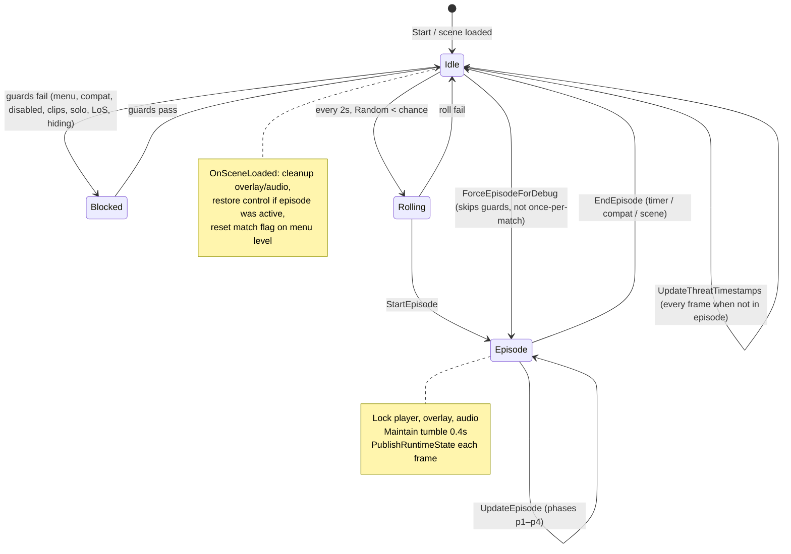

# Code Review: Systems/PsychoticBreak

**Reviewed:** 2026-06-02  
**Scope:** `Systems/PsychoticBreak/` and integration (registry, config, `DreadRuntimeState`, `EnemyScanCache`, Core compat, audio loading, debug overlay/MCP, tension adjacency). Builds on [01-core-review.md](01-core-review.md) through [04-patches-review.md](04-patches-review.md); does not re-review Core/Patches/UI/Notifications in depth.  
**Files inventoried:** `PsychoticBreakSystem.cs`, `PsychoticBreakTrigger.cs`, `PsychoticBreakEpisode.cs`, `PsychoticBreakOverlay.cs`, `PsychoticBreakPlayerLockdown.cs`, `PsychoticBreakAudio.cs`, plus integration: `FlashlightStateTracker.cs`, `EnemyScanCache.cs`, `DreadRuntimeState.cs`, `DreadSystemRegistry.cs`, `Config/DreadConfig.cs`, `Systems/DebugOverlay/DebugOverlayPanel.cs`, `Systems/DebugServerSystem.cs`, `docs/agents/guides/psychotic-break.md`, `docs/adr/0011-psychotic-break-system.md`

## Executive Summary

`Systems/PsychoticBreak/` is a **well-scoped ARCH-1 split**: one `partial class PsychoticBreakSystem` across six files (~990 lines) with clear responsibilities (core loop, triggers, episode FX, overlay, lockdown, audio). Integration with **`EnemyScanCache`**, **`PlayerControllerCompat` / `PlayerTumbleCompat`**, **`AudioClipLoader`**, and **`DreadRuntimeState`** matches agent guides and ADR-0016. The feature is **client-local**, registry-hosted, and debuggable via overlay + MCP.

Main risks: **lifecycle cleanup gaps** (forced tumble/input not released on `OnDestroy`; `DoStumble` coroutine can outlive scene changes), **`PlayerTumbleCompat` global forced flag** (documented in Core review), **GC from `FindObjectsOfType<PlayerController>`** on solo checks, **ADR-0011 drift** vs shipped audio names and hide conditions, and the **shared CI analyze glob gap** for nested `Systems/**` (same as prior reviews). No Harmony in this folder; reflection for overlay UI and input lock is intentional per `reflection-inventory.md`.

**Review outcome:** ❌ **ISSUES** — acceptable feature quality for shipping, but IMPORTANT cleanup and doc sync items should be tracked before treating the subsystem as “refactored done.”

## File Structure Assessment

### Current layout (appropriate)

| File | Role | Lines (approx.) |
|------|------|----------------:|
| `PsychoticBreakSystem.cs` | Boot, config, scene, `Update`, runtime publish, debug force | 242 |
| `PsychoticBreakTrigger.cs` | Threat memory, solo/LoS/hiding, `CanTrigger` / block reasons | 193 |
| `PsychoticBreakEpisode.cs` | Episode phases, overlay alpha, stumble coroutine | 170 |
| `PsychoticBreakOverlay.cs` | Runtime uGUI canvas (reflection) | 156 |
| `PsychoticBreakPlayerLockdown.cs` | Flashlight, input, tumble lock | 90 |
| `PsychoticBreakAudio.cs` | Clip load, footsteps, screams, phantoms | 138 |

**Keep psychotic break out of `TensionSystem`** — ADR-0011 and `psychotic-break.md` are correct; tension stays proximity/stamina; break is a separate episode state machine.

**Related but outside folder:**

| Path | Note |
|------|------|
| `Systems/FlashlightStateTracker.cs` | Small helper; could move under `PsychoticBreak/` or `UI/Shared` later |
| `Systems/OverlayTextureUtil.cs` | Shared vignette helper (see [02-ui-review.md](02-ui-review.md)) |
| `Systems/EnemyScanCache.cs` | Shared enemy list (ADR-0008 evolution); psychotic break must not add a second cache |

**Do not collapse** partials back into a monolith without a refactor ticket; the split matches ROADMAP **ARCH-1** (done).

### Documentation drift

| Source | Says | Code / config says |
|--------|------|-------------------|
| ADR-0011 | `shadow_scream_1/2/3.ogg`, `phantom_footsteps.ogg` | `scream_peak`, `scream_distant`, `scream_threat`, `footsteps.ogg` |
| ADR-0011 | Trigger: “crouching” only | `IsHidingVulnerable` = crouch **or** tumble (guide + `PlayerControllerCompat` agree) |
| ADR-0011 | `Systems/PsychoticBreakSystem.cs` single file | `Systems/PsychoticBreak/*.cs` partials |
| ADR-0011 | Enemy cache from TensionSystem | `EnemyScanCache` (0.5s), independent of `TensionSystem` |
| `psychotic-break.md` | Config section `6. Psychotic Break` | `DreadConfig` binds `4. Psychotic Break` |

## Lifecycle and state machine



**Episode phase timeline** (default 20s, configurable 5–60s):

| Phase | Time fraction | Effects |
|-------|---------------|---------|
| p1 | 0%–15% | Darkness ramp 0 → 0.85 |
| p2 | 15%–50% | Vignette flicker, footstep pan L→R |
| p3 | 50%–80% | Peak scream once, phantom sounds ~1/s, volume/pan intensity |
| p4 | 80%–100% | Peak visuals, fade out, footstep stop; `EndEpisode` at ≥ duration−0.5s |

## Integration map

| Dependency | Usage in psychotic break |
|------------|-------------------------|
| `DreadSystemRegistry` | `"psychotic-break"` → `PsychoticBreakSystem` on `DreadPsychoticBreakHost` |
| `DreadConfig` | `PsychoticBreak*` + `CompatibilityMode` (disables feature; mid-episode calls `EndEpisode`) |
| `DreadRuntimeState` | `PublishRuntimeState()` every `Update` / episode frame (overlay, MCP, debug server) |
| `EnemyScanCache` | Threat scan + visibility; `Invalidate()` on scene load |
| `EnemyHealthCompat` | Validity, visibility alive check |
| `PlayerControllerCompat` | `IsAlive`, `IsHidingVulnerable` |
| `PlayerTumbleCompat` | Forced tumble for episode; global `_forcedActive` (see Core review) |
| `AudioClipLoader` | `LoadAudioClips` coroutine; shared cache (ADR-0007, AUDIO-1) |
| `AudioPlayUtil` | Destroy timing for one-shot screams/phantoms |
| `OverlayTextureUtil` | Vignette texture only |
| `TensionSystem` | **No direct calls** — parallel client-local systems |
| `DebugOverlayPanel` | Reads `PsychoticBreak*` runtime fields |
| `DebugServerSystem` | `force_psychotic_break`, `get_runtime_state`, health check `psychotic_break_clips` |

## Issues

### [SEVERITY: CRITICAL] CI analyze globs omit `Systems/PsychoticBreak/**`

- **Location:** `.github/workflows/ci.yml` analyze job (see [01-core-review.md](01-core-review.md))
- **Category:** maintainability
- **Description:** Psychotic break sources are not scanned for null-forgiving abuse, 120-char lines, tabs, or trailing whitespace. Same blind spot as Core, Patches, ErrorReporting, DebugOverlay.
- **Suggested fix:** Include `Systems/**/*.cs` in CI and `scripts/verify-dread.ps1` Tier-0 style checks.

### [SEVERITY: IMPORTANT] `OnDestroy` does not restore player control or release forced tumble

- **Location:** `PsychoticBreakSystem.cs:85-103` (`OnDestroy`); `PsychoticBreakPlayerLockdown.cs:29-37`
- **Category:** bug
- **Description:** `OnDestroy` unsubscribes config, stops coroutines, cleans overlay/audio, but never calls `RestorePlayerControl` or `PlayerTumbleCompat.ReleaseForcedTumble`. If the host `GameObject` is destroyed mid-episode (unload, mod disable, registry teardown), input lock, disabled flashlight, and global forced tumble can persist.
- **Suggested fix:**
  ```csharp
  private void OnDestroy()
  {
      StopAllCoroutines();
      if (_episodeActive)
          RestorePlayerControl(PlayerController.instance);
      else
          PlayerTumbleCompat.ReleaseForcedTumble(PlayerController.instance);
      // ... existing cleanup
  }
  ```

### [SEVERITY: IMPORTANT] `DoStumble` coroutine can run after scene change

- **Location:** `PsychoticBreakEpisode.cs:127-168`, `PsychoticBreakSystem.cs:105-121` (`OnSceneLoaded`)
- **Category:** bug
- **Description:** `EndEpisode` starts `DoStumble()` on `_mainCam` after `_episodeActive = false`. `OnSceneLoaded` only calls `RestorePlayerControl` when `_episodeActive` is true, so it does not stop an in-flight stumble. Camera roll/offset may apply to a stale or wrong camera after async load.
- **Suggested fix:** Track stumble coroutine handle; `StopCoroutine` in `OnSceneLoaded`, `EndEpisode` (re-entry), and `OnDestroy`. Null-check `cam` each frame; bail if `cam.gameObject.scene != active scene`.

### [SEVERITY: IMPORTANT] `PlayerTumbleCompat._forcedActive` is process-global

- **Location:** `PlayerTumbleCompat.cs:13, 74, 90-95`; callers in `PsychoticBreakPlayerLockdown.cs`
- **Category:** bug (cross-cutting)
- **Description:** Already flagged in [01-core-review.md](01-core-review.md). Psychotic break is the primary consumer. Episode end calls `ReleaseForcedTumble`, but destroy path above can skip release.
- **Suggested fix:** Per-`PlayerController` forced map; ensure all episode exit paths release the same instance that was locked.

### [SEVERITY: IMPORTANT] `IsSolo` allocates via `FindObjectsOfType` every 2 seconds

- **Location:** `PsychoticBreakTrigger.cs:103-126`
- **Category:** performance
- **Description:** Static cache limits frequency but each refresh allocates a new `PlayerController[]`. Runs on the trigger path whenever the 2s roll window is active (not every frame, but still steady GC during eligible play).
- **Suggested fix:** Reuse a static `List<PlayerController>` filled via non-alloc API if available, or share a player cache with tension/debug (single 2s refresh for all consumers).

### [SEVERITY: IMPORTANT] `ForceEpisodeForDebug` does not require loaded clips

- **Location:** `PsychoticBreakSystem.cs:229-240`; natural trigger uses `AreClipsLoaded()` in `GetTriggerBlockReason` / `CanTrigger`
- **Category:** design
- **Description:** MCP/`force_psychotic_break` can start a silent or partial episode (overlay/lock still run). Misleading for verify scripts that assume audio proof.
- **Suggested fix:** Log warning and optionally no-op when clips missing; document in `psychotic-break.md` and ADR-0013 tool table.

### [SEVERITY: IMPORTANT] ADR-0011 out of date vs implementation

- **Location:** `docs/adr/0011-psychotic-break-system.md`
- **Category:** maintainability
- **Description:** Wrong audio filenames, single-file path, TensionSystem cache wording, and “crouching only” trigger text. Agents reading ADR without `psychotic-break.md` will implement the wrong contract.
- **Suggested fix:** Update ADR asset table, trigger list (hiding = crouch or tumble), implementation path, and `EnemyScanCache` reference; link to `docs/agents/guides/psychotic-break.md` as operational source.

### [SEVERITY: IMPORTANT] Duplicated trigger logic (`GetTriggerBlockReason` vs `CanTrigger`)

- **Location:** `PsychoticBreakTrigger.cs:10-36` vs `88-101`
- **Category:** maintainability
- **Description:** Same predicates maintained twice; drift risk (e.g. future “stamina” guard added to one path only). `CanTrigger` also omits explicit `_enabled` check (relies on caller).
- **Suggested fix:** Single internal method returning enum or struct `{ bool canTrigger; string? blockReason; }` used by both `PublishRuntimeState` and roll path.

### [SEVERITY: IMPORTANT] `DisableFlashlight` uses first child `Light` without guard

- **Location:** `PsychoticBreakPlayerLockdown.cs:39-49`
- **Category:** bug
- **Description:** `GetComponentInChildren<Light>()` may hit a non-flashlight light (ambient attachment, VFX). Wrong light disabled; tracker restores wrong source.
- **Suggested fix:** Prefer named/tag path via compat (e.g. flashlight field names in `PlayerControllerCompat`), or narrow search to known flashlight hierarchy.

### [SEVERITY: NICE_TO_HAVE] Episode phase thresholds are magic ratios

- **Location:** `PsychoticBreakEpisode.cs:46-48`
- **Category:** maintainability
- **Description:** `0.15f`, `0.50f`, `0.80f` match ADR table only when duration is 20s; for 5s or 60s configs the beat timing stretches/compresses proportionally (may be intended) but is undocumented in code.
- **Suggested fix:** Named constants `Phase1EndFraction`, etc., with comment tying to design doc.

### [SEVERITY: NICE_TO_HAVE] `LockInput` / `UnlockInput` re-create `Traverse` every 0.4s during episode

- **Location:** `PsychoticBreakPlayerLockdown.cs:60-88`; `MaintainPlayerFallenState` interval `0.4f`
- **Category:** performance
- **Description:** Four try/catch Traverse blocks per maintain tick. Works but noisy; Core review suggested shared compat helper.
- **Suggested fix:** Cache successful field `Traverse` accessors on first lock; only re-apply values on maintain.

### [SEVERITY: NICE_TO_HAVE] Visibility scan: `VisionBlockMask = -1` and per-enemy `Linecast`

- **Location:** `PsychoticBreakTrigger.cs:50-51`, `141-187`
- **Category:** performance
- **Description:** Every 0.25s, all cached enemies may get a full-mask linecast from camera. Acceptable for small enemy counts; scales poorly in crowded scenes.
- **Suggested fix:** Layer mask limited to level geometry; early-out distance; cap enemies checked per tick.

### [SEVERITY: NICE_TO_HAVE] `UpdateThreatTimestamps` skipped when feature disabled

- **Location:** `PsychoticBreakSystem.cs:155-158` (early return before threat update)
- **Category:** design
- **Description:** Disabling psychotic break freezes threat memory decay/extension until re-enabled. Edge case for toggling config mid-run.
- **Suggested fix:** Run threat memory update whenever in-level, independent of `_enabled`, or reset `_threatMemoryUntil` on disable.

### [SEVERITY: NICE_TO_HAVE] One-shot audio hosts use `DontDestroyOnLoad` without central pool

- **Location:** `PsychoticBreakAudio.cs:100-107`, `122-135`
- **Category:** performance
- **Description:** Peak/phantom spawns new `GameObject` per play; `Destroy` delayed via `AudioPlayUtil`. Fine at low rate; phantom phase can spawn many over p3.
- **Suggested fix:** Small pool of `AudioSource` on episode host, or parent under `_footstepSource` root.

### [SEVERITY: NICE_TO_HAVE] `FlashlightStateTracker` is `public` on `Systems/` root

- **Location:** `Systems/FlashlightStateTracker.cs`
- **Category:** structure
- **Description:** Only psychotic break uses it; public type widens API surface.
- **Suggested fix:** `internal` class under `PsychoticBreak/` or nested private component pattern.

### [SEVERITY: STYLE] Log prefix inconsistency

- **Location:** `PsychoticBreakEpisode.cs:25, 142` (`[Dread]`); elsewhere `[PsychoticBreak]`
- **Category:** style
- **Suggested fix:** Standardize on `[PsychoticBreak]` for grep-friendly logs.

### [SEVERITY: STYLE] Empty `catch` blocks on reflection paths

- **Location:** `PsychoticBreakTrigger.cs:80`, `151-183`; `PsychoticBreakPlayerLockdown.cs:64-85`
- **Category:** style / maintainability
- **Description:** Matches compat policy but conflicts with reviewer criterion “no silent failures.” Lock path logs once if no field matched (good); visibility/trigger catches are fully silent.
- **Suggested fix:** Verbose log once per failure site when `DreadConfig` debug flag set (align with Core review P3).

## Positive Patterns

- **ARCH-1 partial split** — Trigger, episode, overlay, lockdown, and audio are navigable without a 1k-line monolith.
- **Shared `EnemyScanCache`** — No duplicate `FindObjectsOfType<EnemyHealth>` list; obeys `psychotic-break.md` agent rule.
- **AUDIO-1 safe clip usage** — Episode cleanup destroys `AudioSource` hosts, not cached `AudioClip` assets from `AudioClipLoader`.
- **Runtime state contract** — `PublishRuntimeState()` feeds debug overlay and MCP with block reasons and threat seconds (well-named for tooling).
- **Compatibility mode** — Mid-episode `CompatibilityMode` check ends episode immediately (`UpdateInternal` lines 144-148).
- **Stub-safe overlay** — Reflection-based uGUI matches `psychotic-break-overlay-ui` **keep** in reflection inventory; `OverlayTextureUtil` for Proton-safe vignette.
- **TypeInitializationException guard** — Disables component after init failure instead of spamming errors (stub/game mismatch).
- **Scene hygiene** — `OnSceneLoaded` resets match flag on menu, invalidates enemy cache, cleans overlay/footstep sources.
- **Hide condition evolution** — `IsHidingVulnerable` documents tumble-as-hide for REPO builds (guide + compat, ahead of stale ADR).

## Recommended Agent Prompts

**P0 (CI):**  
> Expand analyze globs to `Systems/**/*.cs`. Run on PsychoticBreak partials; fix any null-forgiving or line-length violations found.

**P1 (lifecycle):**  
> In `OnDestroy` and `OnSceneLoaded`, always `RestorePlayerControl` / `ReleaseForcedTumble` when episode was or may have been active; stop and clear `DoStumble` coroutine. Add manual verify: force episode, unload scene mid-episode and post-episode stumble.

**P1 (tumble):**  
> Implement per-player forced tumble in `PlayerTumbleCompat` (from Core review); retest psychotic break end, destroy, and debug force.

**P2 (docs):**  
> Refresh ADR-0011 (audio names, hiding, file layout, `EnemyScanCache`). Fix `psychotic-break.md` config section number (`4.` not `6.`).

**P2 (trigger DRY):**  
> Merge `GetTriggerBlockReason` and `CanTrigger` into one predicate builder; add unit-style table test or debug-server snapshot test for block reason strings.

**P2 (debug force):**  
> `ForceEpisodeForDebug`: warn or block when `!AreClipsLoaded()`; update MCP tool docs.

**P3 (performance):**  
> Replace solo `FindObjectsOfType` with shared player cache; cache Traverse for input lock; optional visibility linecast budget.

**P3 (flashlight):**  
> Narrow flashlight resolution via compat helper; avoid blind `GetComponentInChildren<Light>()`.

## Cross-references

| Doc | Relevance |
|-----|-----------|
| [01-core-review.md](01-core-review.md) | CI globs; `PlayerTumbleCompat` global state; `EnemyHealthCompat` visibility fail-open |
| [02-ui-review.md](02-ui-review.md) | `OverlayTextureUtil`; psychotic overlay vs debug IMGUI |
| [03-notifications-review.md](03-notifications-review.md) | Psychotic break as gameplay FX, not messaging |
| [04-patches-review.md](04-patches-review.md) | No Harmony in psychotic break; compat mode table |
| [ADR-0011](../adr/0011-psychotic-break-system.md) | Product intent (needs sync) |
| [ADR-0016](../adr/0016-arch-3-extension-model.md) | Registry row, `PsychoticBreak*` runtime fields |
| [ADR-0013](../adr/0013-debug-server.md) | `force_psychotic_break`, runtime snapshot |
| [ADR-0007](../adr/0007-audio-clip-loader.md) | Shared loader / cache |
| [ADR-0008](../adr/0008-shared-enemy-cache.md) | Historical; superseded by `EnemyScanCache` for new code |
| [psychotic-break.md](../agents/guides/psychotic-break.md) | Operational trigger/verify guide |
| [reflection-inventory.md](../agents/guides/reflection-inventory.md) | `psychotic-break-lockdown`, `psychotic-break-overlay-ui` |
| [ROADMAP.md](../ROADMAP.md) | ARCH-1 done; AUDIO-1 clip cache |

### Caller / wiring map (rg, 2026-06-02)

| Symbol | Called from / consumers |
|--------|-------------------------|
| `PsychoticBreakSystem` | `DreadSystemRegistry`; `DebugServerSystem.ForcePsychoticBreak` |
| `PublishRuntimeState` / `DreadRuntimeState.PsychoticBreak*` | `DebugOverlayPanel`, `DebugServerSystem.CaptureRuntimeState` |
| `EnemyScanCache.GetEnemies` | `UpdateThreatTimestamps`, visibility (via cached array) |
| `PlayerControllerCompat.IsHidingVulnerable` | `CanTrigger`, `GetTriggerBlockReason` |
| `PlayerTumbleCompat.*` | `PsychoticBreakPlayerLockdown` |
| `AudioClipLoader.LoadClips` | `LoadAudioClips` coroutine |
| `OverlayTextureUtil.CreateVignette` | `CreateOverlay` |
| `ForceEpisodeForDebug` | Debug server / MCP (local, `DebugServerEnabled`) |

### Severity summary

| Severity | Count |
|----------|------:|
| CRITICAL | 1 |
| IMPORTANT | 8 |
| NICE_TO_HAVE | 6 |
| STYLE | 2 |

**Top 3 concerns:** (1) **Episode teardown gaps** (`OnDestroy` / scene load / stumble coroutine leaving lock, tumble, or camera mutated); (2) **`PlayerTumbleCompat` global forced tumble** compounded by missing destroy release; (3) **maintainability + verify drift** (duplicated trigger guards, stale ADR-0011, debug force without clip guard, CI blind spot on nested `Systems/**`).
