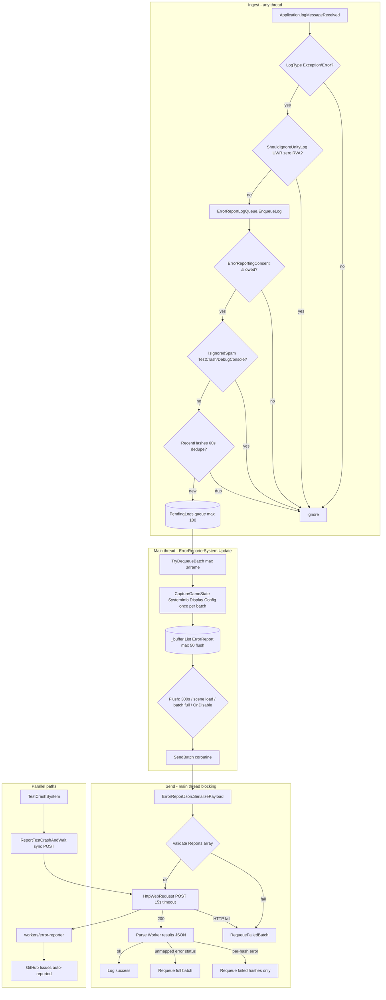

# Code Review: Systems/ErrorReporting

**Reviewed:** 2026-06-02  
**Scope:** Error telemetry pipeline (game client, JSON, Cloudflare Worker, tests) and related loose files. Builds on [01-core-review.md](01-core-review.md) through [05-psychotic-break-review.md](05-psychotic-break-review.md); does not re-review Core/Patches/UI/PsychoticBreak in depth.  
**Files inventoried:** `Systems/ErrorReporting/*.cs`, `Systems/ErrorReportJson.cs`, `Systems/ErrorReportTypes.cs`, `Systems/TestCrashSystem.cs`, `workers/error-reporter/*`, `tests/Dread.ErrorReportJson.Tests/*`, plus integration: `Plugin.cs`, `DreadSystemInitializer.cs`, `DreadSystemRegistry.cs`, `Config/DreadConfig.cs`, `Systems/LoggingService.cs`, `Systems/DebugServerSystem.cs`, `docs/agents/error-reporting-test-checklist.md`, ADR-0010/0012/0015, specs ERR-2/ERR-3

## Executive Summary

The error reporting subsystem is **coherent and contract-driven**: Unity log hook → main-thread queue → batched `ErrorReport` DTOs → manual `ErrorReportJson` → synchronous `HttpWebRequest` POST → Cloudflare Worker → GitHub Issues. ERR-2 consent (`ErrorReportingConsent` + `ErrorReportingPromptSystem`) and ERR-3 copy (`ErrorReportingPrivacyCopy`) are implemented as specced. **xUnit JSON tests pass (4/4)**; stub Release build succeeds.

Boundaries vs other surfaces (see [03-notifications-review.md](03-notifications-review.md)): **`ErrorReporterSystem` has no OnGUI** and only logs outcomes via `LoggingService`. The first-run prompt is a **blocking IMGUI modal** under `ErrorReporting/`, not a notification API. Do not reuse `ErrorReportingConsent` for future toasts.

Main risks: **main-thread blocking HTTP** (15s timeout per flush), **silent loss** when the pending queue is full or the component disables before consent/send, **unbounded `RecentHashes` growth**, **full-batch requeue** on ambiguous Worker errors (duplicate-issue risk), **scattered JSON/types at `Systems/` root**, and the **shared CI glob gap** for nested `Systems/**`. ADR-0010 still mentions `UnityWebRequest` for batch flush; production code uses `HttpWebRequest` per ADR-0015.

**Review outcome:** ❌ **ISSUES:** pipeline is shippable and well-tested at the JSON boundary, but IMPORTANT reliability and boundary items should be tracked (especially sync POST on the game thread and queue/backpressure behavior).

## File Structure Assessment

### Current layout

```
Systems/
  ErrorReportJson.cs           # Manual serializer (ADR-0015)
  ErrorReportTypes.cs          # DTOs shared by game + tests
  TestCrashSystem.cs           # Debug-only crash + sync POST (ADR-0012)
  ErrorReporting/
    ErrorReporterSystem.cs     # logMessageReceived, buffer, flush coroutine
    ErrorReportLogQueue.cs     # Static queue, spam filter, client dedupe
    ErrorReportPayloadCapture.cs
    ErrorReportUploader.cs     # HttpWebRequest POST + response parsing
    ErrorReportingConsent.cs   # cfg gate
    ErrorReportingPromptSystem.cs  # ERR-2 IMGUI modal (not telemetry)
    ErrorReportingPrivacyCopy.cs   # ERR-3 canonical strings
workers/error-reporter/
  index.js                     # Rate limit, GitHub search/create/comment
  test/index.test.ts           # Vitest
tests/Dread.ErrorReportJson.Tests/
  ErrorReportJsonTests.cs
```

| Concern | Current home | Recommendation |
|---------|--------------|----------------|
| JSON DTOs + serializer | `Systems/ErrorReport*.cs` (flat) | **Optional:** move to `Systems/ErrorReporting/` or `Systems/ErrorReporting/Serialization/` for one folder per feature (domain.md already documents flat paths; low priority) |
| Player consent UI | `ErrorReportingPromptSystem` | **Keep** here until ROADMAP **UI-1** shared IMGUI kit; do not fold into a future `Notifications/` folder without a new ADR |
| Test harness | `TestCrashSystem` at `Systems/` root | Acceptable: debug `SystemOrderGroup.Debug` registration; could live beside reporter if file count matters |
| Worker | `workers/error-reporter/` | Correct separation; PAT never in DLL |

**Registry (`DreadSystemRegistry.cs`):**

| Id | Type | Group | `IsEnabled` |
|----|------|-------|-------------|
| `error-reporter` | `ErrorReporterSystem` | Core | always |
| `error-reporting-prompt` | `ErrorReportingPromptSystem` | Core | always (self-gates on cfg) |
| `test-crash` | `TestCrashSystem` | Debug | always |

Boot: `Plugin.Awake` → `SceneManager.sceneLoaded` → `DreadSystemInitializer.TryInitialize()` once UI assemblies load → registry spawns hosts. No direct `Plugin` references to error types (good ARCH-3 boundary).

### Notifications vs UI vs ErrorReporting (user concern)

| Surface | Location | Role |
|---------|----------|------|
| BepInEx console | `LoggingService` | Operator logs only; **not** player messaging |
| Consent modal | `ErrorReportingPromptSystem` | One-time blocking disclosure (ERR-2) |
| Telemetry | `ErrorReporterSystem` + queue/uploader | No UI |
| Debug HUD | `DebugOverlay/*` | F10 dev overlay (separate) |
| MCP / debug server | `DebugServerSystem` | `dread_trigger_test_crash`, config toggles |

`ErrorReportingConsent.IsReportingAllowed()` must remain **telemetry-only** (prompt shown + `ErrorReportingEnabled`). See [03-notifications-review.md](03-notifications-review.md).

## Report lifecycle (data flow)



**TestCrash path (ADR-0012):** config button → `Debug.LogException` (ignored by spam filter) → `ReportTestCrashAndWait` with unique hash (`|testcrash|` + ticks) → sync POST → `Process.Kill()` (non-editor). Does not use `_buffer` or 300s flush.

## Integration map

| Dependency | Usage |
|------------|--------|
| `DreadConfig.ErrorReportingEnabled` / `ErrorReportingPromptShown` | Consent + cfg description via `ErrorReportingPrivacyCopy.FullDescription` |
| `EnemyScanCache` + `EnemyHealthCompat` | Enemy counts in `CaptureGameState` |
| `PlayerController` direct fields | `Health`, `stamina`, `transform.position` (bypasses `PlayerControllerCompat`; see Core review) |
| `LoggingService` | All reporter outcomes; no in-game toast |
| `DebugServerSystem` | MCP test crash, config snapshot includes `errorReporting` |
| `Plugin.VERSION` | Payload `ModVersion` |
| Cloudflare Worker | Hardcoded `ErrorReportUploader.WorkerUrl` |

## Issues

### [SEVERITY: CRITICAL] CI analyze globs omit `Systems/ErrorReporting/**`

- **Location:** `.github/workflows/ci.yml` analyze job (same as [01-core-review.md](01-core-review.md))
- **Category:** maintainability
- **Description:** Grep targets `Systems/*.cs` only, not nested folders. Error reporting sources skip null-forgiving, 120-char, whitespace, and tab rules documented in AGENTS.md.
- **Suggested fix:** Include `Systems/**/*.cs` in CI and `scripts/verify-dread.ps1`.

### [SEVERITY: IMPORTANT] Batch send blocks the Unity main thread

- **Location:** `ErrorReportUploader.TryPostPayloadSync` (`Timeout = 15000`); called from `ErrorReporterSystem.SendBatch` coroutine after `yield return null` (still main thread)
- **Category:** performance / UX
- **Description:** `HttpWebRequest.GetResponse()` is synchronous. A slow or hung Worker can freeze gameplay for up to 15 seconds per batch. `_sendInProgress` prevents overlap but not stutter.
- **Suggested fix:** Background thread for POST (marshal completion to main thread for Unity touch rules), or `UnityWebRequest` when `UnityWebRequestCompat.IsUsable` (ROADMAP ERR-4). Cap payload size and log hitch duration.

### [SEVERITY: IMPORTANT] Pending log queue drops silently at capacity

- **Location:** `ErrorReportLogQueue.cs:46-47`
- **Category:** reliability
- **Description:** When `PendingLogs.Count >= MaxPendingLogs` (100), new errors are dropped with no `LoggingService` warning. High error spam can lose signal entirely.
- **Suggested fix:** Log once per session at Warning; or drop oldest entry (ring buffer) instead of rejecting newest.

### [SEVERITY: IMPORTANT] `RecentHashes` dictionary never prunes

- **Location:** `ErrorReportLogQueue.cs:18`, `45`
- **Category:** memory
- **Description:** Every distinct hash is stored forever in `RecentHashes`. Long sessions with varied errors grow memory without bound (small per entry, but unbounded).
- **Suggested fix:** Prune entries older than `DedupeCooldownSeconds` on enqueue, or use LRU capped at N entries.

### [SEVERITY: IMPORTANT] Full-batch requeue on unmapped Worker errors risks duplicate GitHub issues

- **Location:** `ErrorReporterSystem.HandleWorkerResponse` lines 233-238; `ErrorReportUploader.HasUnmappedWorkerErrors`
- **Category:** reliability
- **Description:** If HTTP 200 body contains `"status":"error"` not tied to a hash via `IsReportFailedInResponse`, the **entire** batch is requeued. Retry can create duplicate issues for reports that already succeeded on the Worker.
- **Suggested fix:** Prefer Worker contract with per-hash results only (already mostly true); on unmapped error, requeue only reports without a matching `"status":"created"|"commented"|"reopened"` in slice; or treat unmapped as terminal log + drop.

### [SEVERITY: IMPORTANT] Buffered reports lost when consent blocks flush

- **Location:** `ErrorReporterSystem.FlushNow` lines 191-192; `OnDisable` line 32
- **Category:** reliability
- **Description:** If reports sit in `_buffer` and the player disables reporting or has not completed the prompt, `FlushNow` returns early and `OnDisable` may never send. Process exit loses buffered reports (ADR-0010 notes no disk persistence).
- **Suggested fix:** On opt-out, either flush once with last-known consent, or clear buffer with Info log listing dropped count; document behavior in privacy copy.

### [SEVERITY: IMPORTANT] Error payload bypasses `PlayerControllerCompat` for HP/stamina

- **Location:** `ErrorReportPayloadCapture.cs:133-135`
- **Category:** maintainability (carried from [01-core-review.md](01-core-review.md))
- **Description:** Enemy path uses `EnemyHealthCompat`; player uses compile-time `player.Health` / `player.stamina`. Game updates or stub mismatches can break telemetry while other systems use compat.
- **Suggested fix:** Route through `PlayerControllerCompat.GetHealth` and a stamina compat helper (or remove dead `GetStamina` after wiring).

### [SEVERITY: IMPORTANT] ADR-0010 architecture diagram drift (UnityWebRequest vs HttpWebRequest)

- **Location:** `docs/adr/0010-error-telemetry.md` lines 38, 73; ADR-0012 line 38
- **Category:** documentation
- **Description:** ADRs still say batch flush uses `UnityWebRequest`. Implementation uses `HttpWebRequest` + `ErrorReportJson` (ADR-0015) because stub builds break UWR. Misleading for agents implementing ERR-4.
- **Suggested fix:** Update ADR-0010/0012 diagrams to match ADR-0015; link ERR-4 for async/UWR follow-up.

### [SEVERITY: IMPORTANT] Duplicate JSON serialization per batch send

- **Location:** `ErrorReporterSystem.SendBatch` lines 258-269; `ErrorReportUploader.TryPostPayloadSync` line 20
- **Category:** performance
- **Description:** `EncodePayload` serializes to validate, then `TryPostPayloadSync` serializes again internally. Doubles CPU and allocations on large batches.
- **Suggested fix:** Single serialize: pass json string into POST helper, or validate using first result only.

### [SEVERITY: IMPORTANT] `ErrorReportingPromptSystem` duplicates fragile input-lock reflection

- **Location:** `ErrorReportingPromptSystem.cs:316-351`
- **Category:** maintainability
- **Description:** Same Traverse field-name loops as `PsychoticBreakPlayerLockdown` (not shared). Empty catches; only one verbose log if all fields fail.
- **Suggested fix:** Extract shared `PlayerInputLockCompat` in `Systems/Core` (or use existing patterns from psychotic break lockdown) when touching either path.

### [SEVERITY: NICE_TO_HAVE] JSON/types live outside `ErrorReporting/` folder

- **Location:** `Systems/ErrorReportJson.cs`, `Systems/ErrorReportTypes.cs`
- **Category:** structure
- **Description:** domain.md ARCH-1 lists them at `Systems/` root intentionally, but agents searching `ErrorReporting/` miss serializer and DTOs.
- **Suggested fix:** Move files into `Systems/ErrorReporting/` (no namespace change) or add `Systems/ErrorReporting/README.md` pointer.

### [SEVERITY: NICE_TO_HAVE] `EncodePayload` return value unused

- **Location:** `ErrorReportUploader.EncodePayload` returns `byte[]`; `SendBatch` discards it
- **Category:** dead-code
- **Suggested fix:** Return `void` or use bytes for POST to avoid second UTF8 encode in `TryPostPayloadSync`.

### [SEVERITY: NICE_TO_HAVE] `FindObjectOfType<PlayerController>()` per capture batch

- **Location:** `ErrorReportPayloadCapture.CaptureGameState` line 117
- **Category:** performance
- **Description:** Called once per dequeue batch (max 3 logs/frame), not every frame, but still allocates. Could use `PlayerController.instance` if stable in REPO.
- **Suggested fix:** Prefer cached/local player reference pattern used elsewhere.

### [SEVERITY: NICE_TO_HAVE] Hardcoded Worker URL in DLL

- **Location:** `ErrorReportUploader.WorkerUrl`
- **Category:** operations
- **Description:** Worker migration requires mod release (ADR-0010 consequence).
- **Suggested fix:** Optional cfg override for staging; keep production default in code.

### [SEVERITY: NICE_TO_HAVE] `ErrorReportingPrivacyCopy` static ctor tied to bullet indices

- **Location:** `ErrorReportingPrivacyCopy.cs:50-60`
- **Category:** maintainability
- **Description:** `FullDescription` loops `i <= 6` then appends bullets 7 and 8. Reordering `DataBullets` breaks legal copy silently.
- **Suggested fix:** Named constants or explicit bullet groups in source.

### [SEVERITY: NICE_TO_HAVE] Config snapshot omits newer feature toggles

- **Location:** `ErrorReportPayloadCapture.CaptureConfigSafe`; `ConfigData` in `ErrorReportTypes.cs`
- **Category:** design
- **Description:** Payload includes 11 toggles (matches ERR-3 bullets). Psychotic break, debug overlay, debug server, compatibility mode are **not** sent. Acceptable if intentional; checklist section J says "all 11 config values" (the 11 captured fields).
- **Suggested fix:** If product wants fuller triage, extend `ConfigData` + serializer + Worker tables + privacy bullets together.

### [SEVERITY: NICE_TO_HAVE] Worker CORS `Access-Control-Allow-Origin: *`

- **Location:** `workers/error-reporter/index.js` `corsHeaders`
- **Category:** security
- **Description:** Browser-origin POSTs allowed; game client is not a browser. Low risk for mod; slightly broad for a reporting endpoint.
- **Suggested fix:** Restrict origins if browser clients are not required.

### [SEVERITY: STYLE] `volatile bool _shouldFlush` on main-thread-only field

- **Location:** `ErrorReporterSystem.cs:14`
- **Category:** style
- **Suggested fix:** Plain `bool`; set only from `Update` and locked sections.

### [SEVERITY: STYLE] Empty `catch` in payload capture and prompt lock

- **Location:** `ErrorReportPayloadCapture.TrySet`; `ErrorReportingPromptSystem.SetPlayerInputLocked`
- **Category:** maintainability
- **Suggested fix:** Optional verbose diagnostics flag (align with Core review P3).

### [SEVERITY: STYLE] `Truncate` nullable return warning

- **Location:** `ErrorReportPayloadCapture.cs:153-157` (CS8603 in build)
- **Suggested fix:** Return `value ?? string.Empty` when over max length path handles null.

## Positive Patterns

- **Thread-safe ingest:** Log callback only enqueues; Unity APIs run on main thread in `Update` (ADR-0010).
- **Consent gate centralized:** `ErrorReportingConsent` used by queue and reporter; ERR-2 contract satisfied.
- **Canonical privacy copy:** Single `ErrorReportingPrivacyCopy` source; cfg + prompt import it (no scattered disclosure strings).
- **Manual JSON with tests:** ADR-0015 `ErrorReportJson` + 4 xUnit tests; avoids proven-broken `JsonUtility` for `Reports[]`.
- **TestCrash isolation:** Spam filter ignores `TestCrashSystem` log hook path; sync POST before kill (ADR-0012).
- **UWR feedback-loop guard:** `ShouldIgnoreUnityLog` filters stub `BadImageFormatException` / zero RVA noise.
- **Partial failure handling:** `CollectFailedReports` requeues only failed hashes when Worker returns per-report status.
- **Safe capture helpers:** `Capture*Safe` + `TrySet` tolerate stub/API gaps without aborting the report.
- **Worker tests:** Vitest suite for rate limit, validation, and GitHub interaction mocks.
- **Clear separation from notifications:** Reporter is headless; prompt is explicit modal, not toast queue.

## Recommended Agent Prompts

**P0 (CI):**  
> Expand analyze globs to `Systems/**/*.cs`. Re-run analyze; fix violations in `ErrorReporting/` and `ErrorReportJson.cs`.

**P1 (main-thread POST):**  
> Spike ERR-4: move POST off main thread or gate on `UnityWebRequestCompat.IsUsable`. Measure frame time during flush; keep TestCrash sync path.

**P1 (queue backpressure):**  
> When `PendingLogs` is full, log Warning once and/or ring-buffer drop oldest. Add verbose counter in debug overlay optional.

**P1 (requeue safety):**  
> Narrow `HasUnmappedWorkerErrors` handling: do not requeue full batch if any hash succeeded; add Worker test for partial success body.

**P2 (compat):**  
> Wire `ErrorReportPayloadCapture` player stats through `PlayerControllerCompat` (Core review).

**P2 (docs):**  
> Sync ADR-0010/0012 batch transport wording with ADR-0015 HttpWebRequest reality.

**P2 (structure):**  
> Move `ErrorReportJson.cs` + `ErrorReportTypes.cs` under `ErrorReporting/` or document cross-links in agent guide.

**P3 (input lock DRY):**  
> Shared player input lock helper for ERR-2 prompt and psychotic break lockdown.

**P3 (memory):**  
> Prune `RecentHashes` periodically.

## Cross-references

| Doc | Relevance |
|-----|-----------|
| [03-notifications-review.md](03-notifications-review.md) | Prompt vs notifications; `LoggingService` is not toast API |
| [01-core-review.md](01-core-review.md) | CI globs; `PlayerControllerCompat` / enemy compat |
| [02-ui-review.md](02-ui-review.md) | IMGUI depth 10000 prompt vs F10 overlay; UI-1 roadmap |
| [ADR-0010](../adr/0010-error-telemetry.md) | Pipeline architecture (needs transport sync) |
| [ADR-0012](../adr/0012-test-crash-button.md) | TestCrash sync path |
| [ADR-0015](../adr/0015-error-report-json-serialization.md) | Manual JSON + requeue |
| [error-reporting-test-checklist.md](../agents/error-reporting-test-checklist.md) | Tier 3 manual matrix |
| [specs/004-err-2-default-on-prompt/](../specs/004-err-2-default-on-prompt/) | Consent + prompt contracts |
| [specs/003-err-3-privacy-copy/](../specs/003-err-3-privacy-copy/) | Privacy copy contract |

### Caller / wiring map (rg, 2026-06-02)

| Symbol | Consumers / triggers |
|--------|----------------------|
| `ErrorReporterSystem` | Registry `error-reporter`; `TestCrashSystem` coroutine |
| `ErrorReportingPromptSystem` | Registry `error-reporting-prompt`; cfg `ErrorReportingPromptShown` |
| `ErrorReportingConsent.IsReportingAllowed` | `ErrorReportLogQueue`, `ErrorReporterSystem` |
| `ErrorReportJson.SerializePayload` | `ErrorReportUploader`, xUnit tests |
| `TestCrashSystem.TriggerForDebug` | `DebugServerSystem` MCP |
| `DreadConfig.ErrorReporting*` | `DreadConfig.Initialize`, prompt, payload config snapshot |

### Verification performed

| Check | Result |
|-------|--------|
| `dotnet build` Release (stubs) | 0 errors |
| `dotnet test` `Dread.ErrorReportJson.Tests` | 4 passed |

### Severity summary

| Severity | Count |
|----------|------:|
| CRITICAL | 1 |
| IMPORTANT | 9 |
| NICE_TO_HAVE | 6 |
| STYLE | 3 |

**Top 3 concerns:** (1) **Main-thread synchronous HTTP** during batch flush (game hitch / 15s timeout); (2) **Silent or ambiguous loss** (queue full, consent-blocked flush, risky full-batch requeue); (3) **Boundary/maintainability** (prompt UI vs notifications, scattered JSON/types, player stats bypassing Core compat, ADR transport drift).
